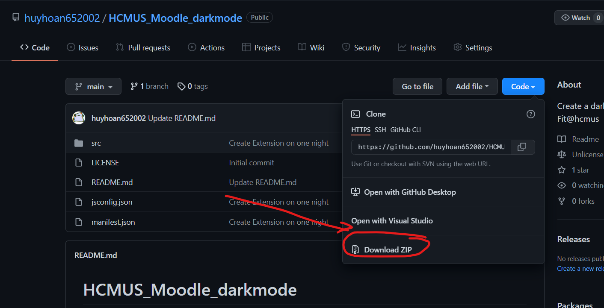
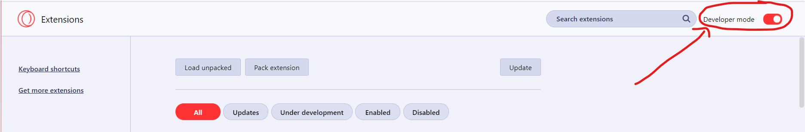
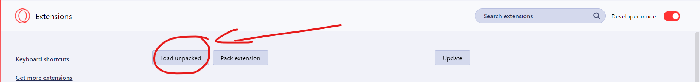
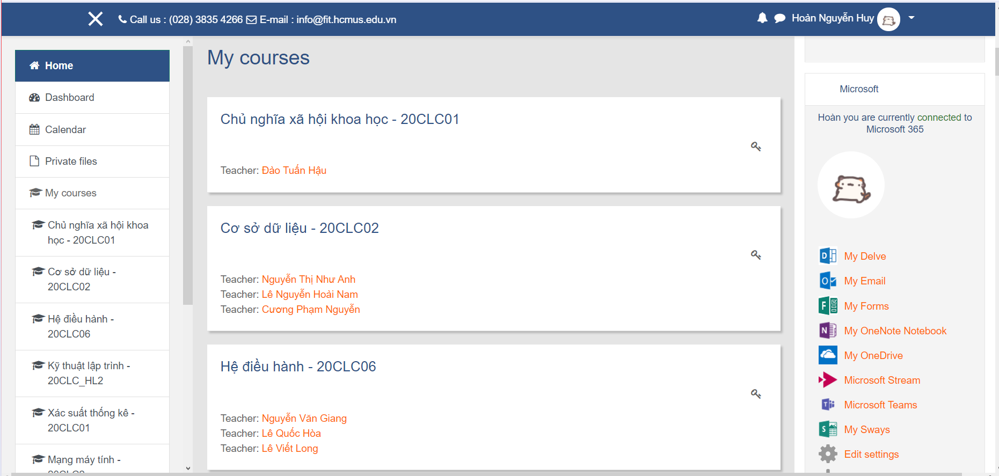

# HCMUS Moodle Blue Theme 

## Đây là dự án biến tấu trang web moodle của chương trình đề án khoa công nghệ thông tin Trường Đại học Khoa học Tự nhiên - ĐHQGHCM thành một trang web moodle với theme của moodle của chương trình chuẩn.

### Extension này được sử dụng cho các web sau

- [courses.ctda.hcmus.edu.vn]() : trang web moodle của chương trình đề án khoa công nghệ thông tin.

# HƯỚNG DẪN SỬ DỤNG

## Đối với trình duyệt Opera/Opera GX:
- Vào github này và download file zip tử github.

- Vào thư mục Downloads và bấm và giải nén file zip.

- Mở trình duyệt Opera/Opera GX và chọn vào logo của extension.

- Chọn "manage extensions"

- Bật chế độ "Developer Mode"

- Chọn vào "Load unpacked" và chọn thư mục vừa giải nén

- Truy cập vào web moodle mà khoa công nghệ thông tin đã cấp cho bạn và chúng ta sẽ có kết quả như hình

## Chúng mình sẽ cập nhật thêm và sửa lỗi cho extension, mong các bạn thông cảm nhé

